= Images
ifdef::flag-book[]
:oldimagesdir: {imagesdir}
:imagesdir: images
endif::[]

== here the overall idea

.Architecture
image::./architecture.png[]

== Captures from the scope
The following images show why it might not be bad to have different cameras connected to a pi microscope setup even if only one is looking through the scope.

[TIP]
====
It's good to have different views and not just close ups all the time.
====

.high magnification RPI (ver 1)
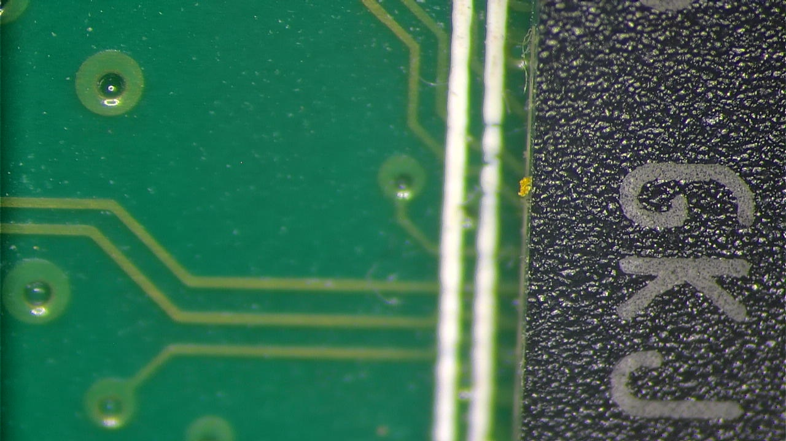

.low magnification RPI (ver 1)
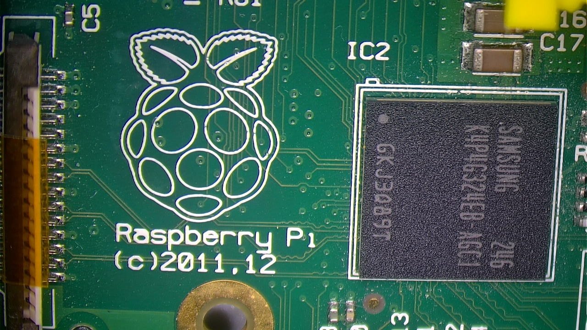

.high magnification RPI connector (ver 1)
image::./capture_20251213_232333.jpg[]

.lower magnification RPI connector (ver 1)
image::./capture_20251213_233248.jpg[]

.lower still magnification RPI connector (ver 1)
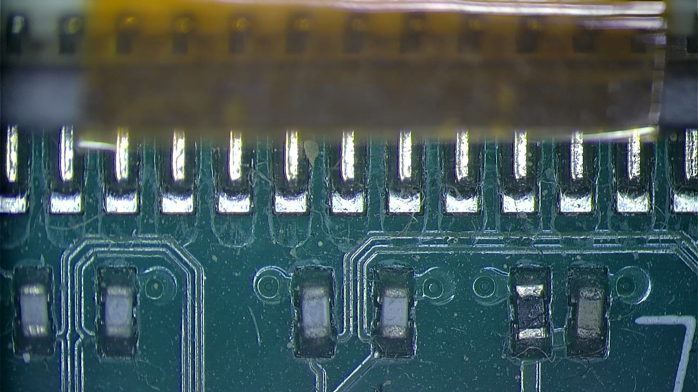

.even lower still magnification RPI connector (ver 1)
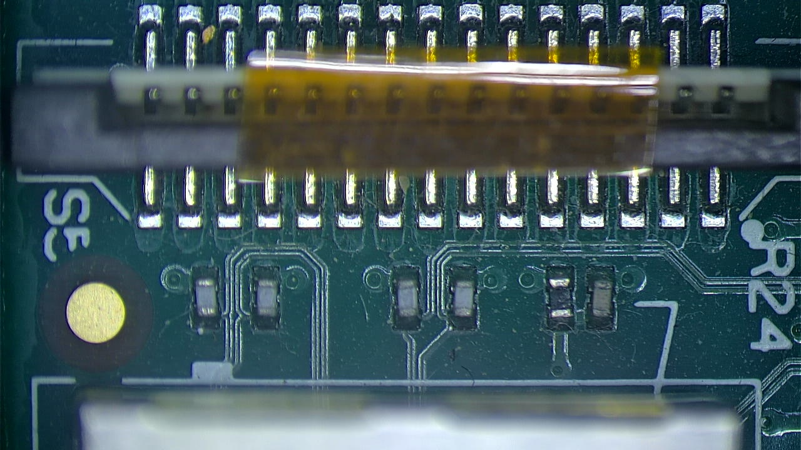

.you get the picture
image::./capture_20251213_233336.jpg[]

.zoomed out RPI connector (ver 1)
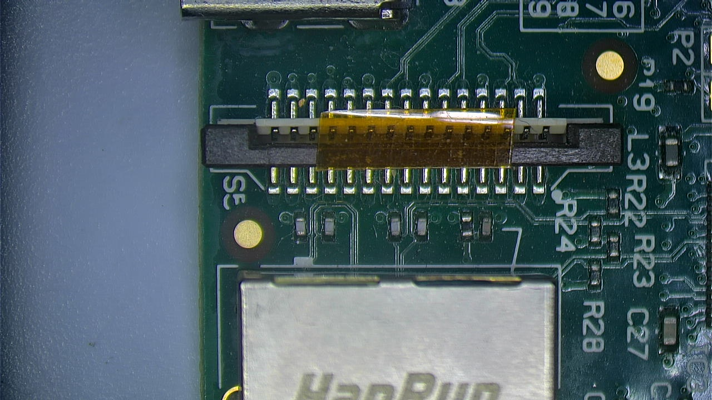

== the project itself
.Top view Microscope with camera module
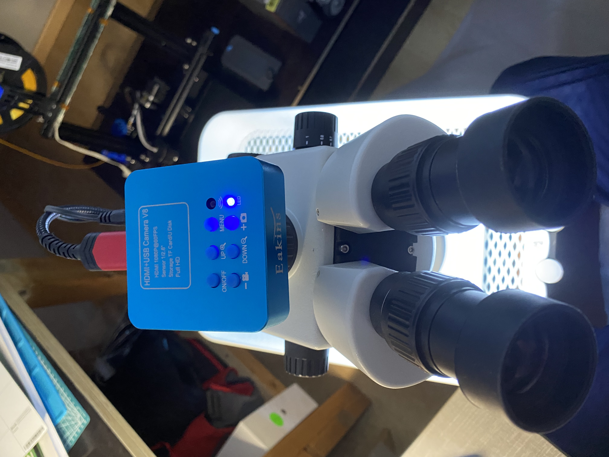

.looking through the microscope
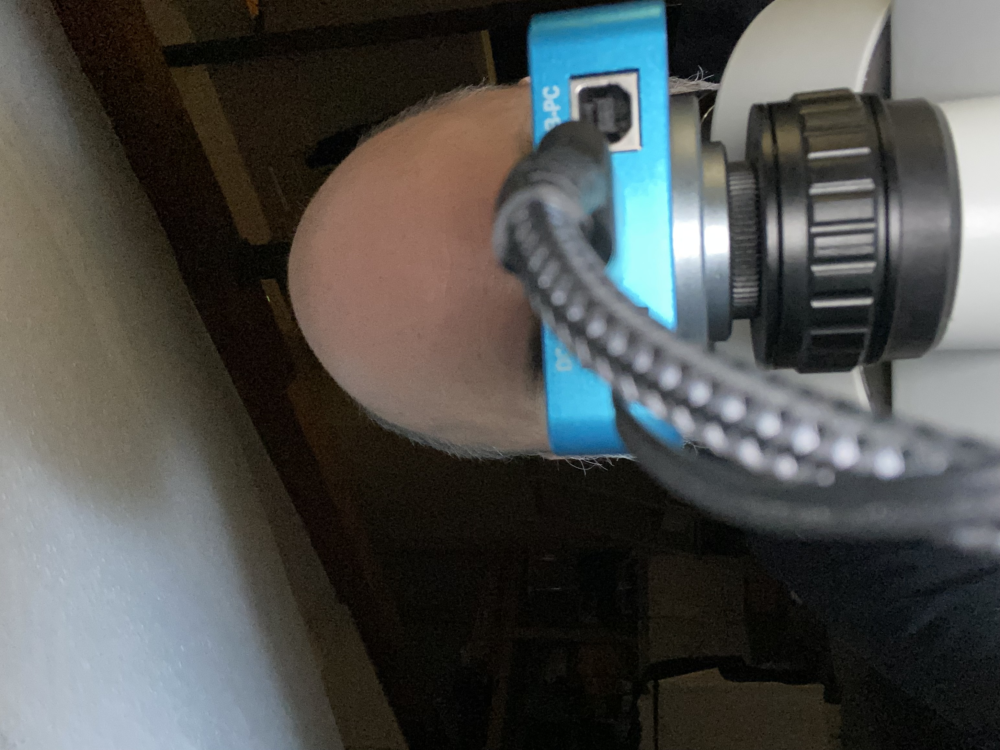

.side view with draft rpi zero connected (and attached night vision rpi cam dangling)
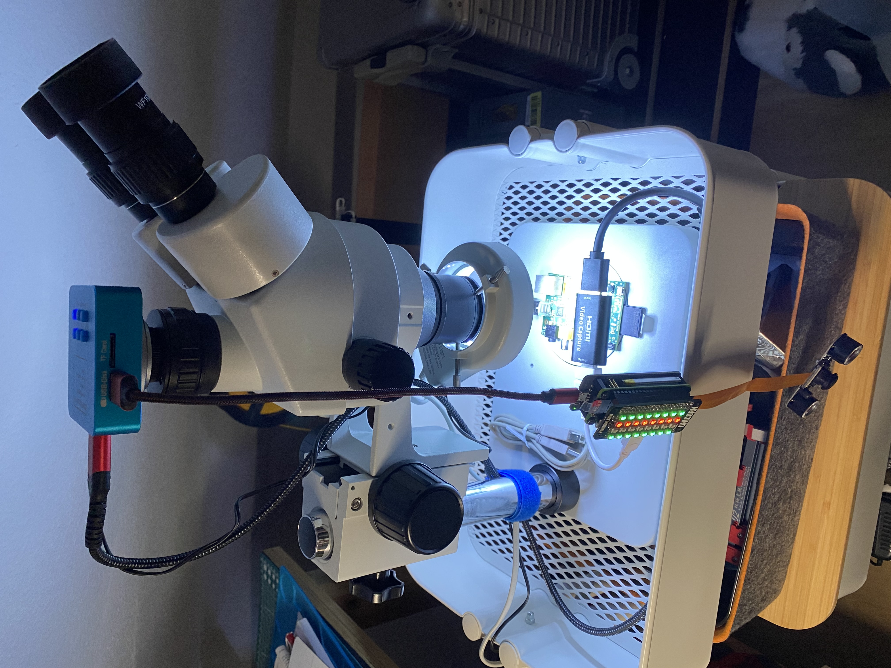

.Night vision rpi cam with active lights
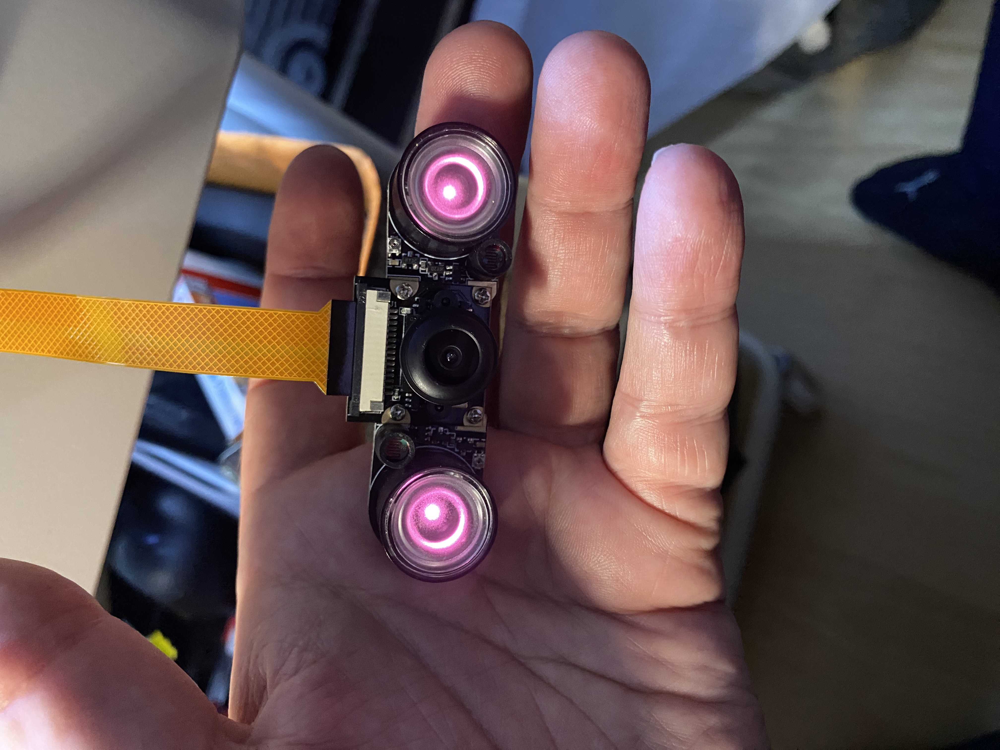

.Lights on if dark
image::./IMG_20251215_004513_656.jpg[]

.Lights off if light enough
image::./IMG_20251215_004506_307.jpg[]

.thermal of the pi cam
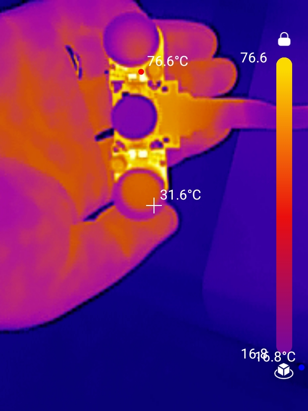

[CAUTION]
====
thermal image shows the pi cam getting hot enough to soften a 3d PLA print easily.
Also it's not the Cam itself but the board... so BEWARE! (note to self: figure out a better way than printing a plastic mount right next to a heat source)
====

[NOTE]
====
The heat seems to stem from SMD parts on the infra red "ears".
It may be possible to just take them off and move them further away from the lens board. The rest seems to be ok for PLA.
====

.HW stack: unicorn hat, rpi zero, ups-lite v1.3 battery
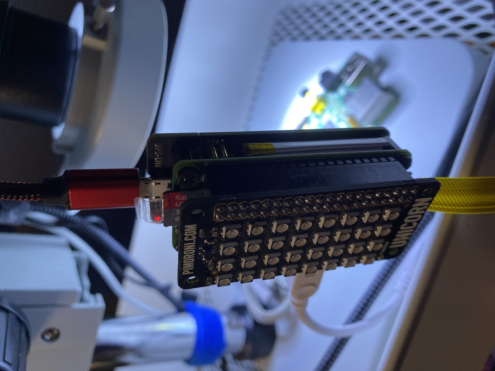

.thermal of HW stack
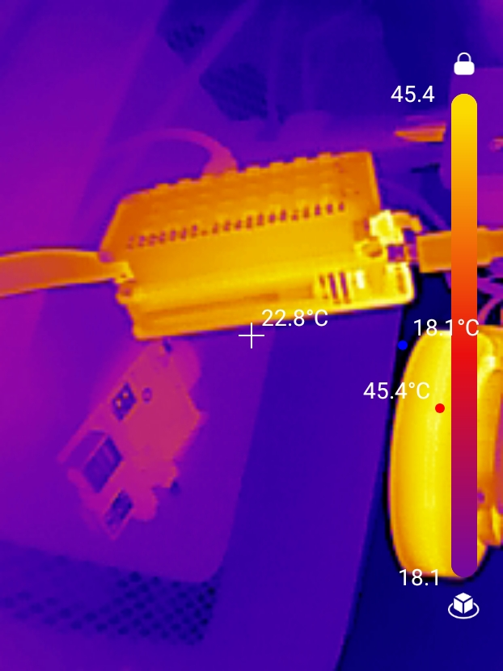

.HDMI USB capture device connected to microscope and rpi zero
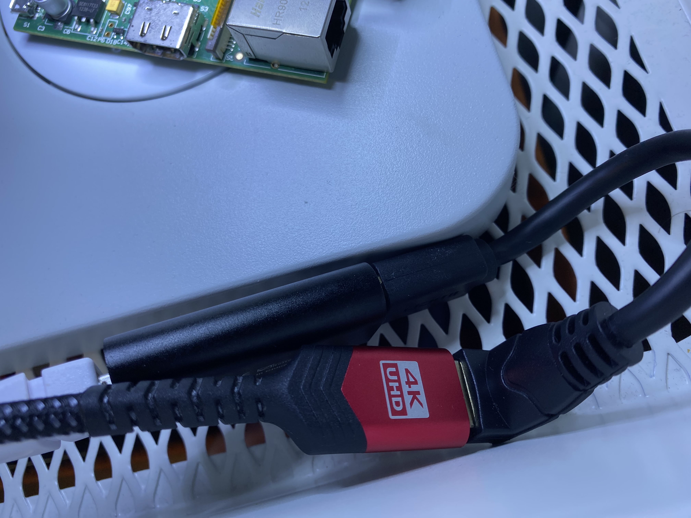

ifdef::flag-book[]
:imagesdir: {oldimagesdir}
endif::[]
